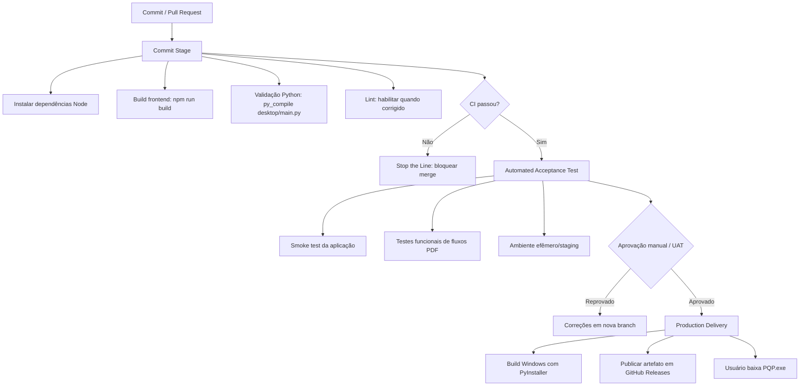

# Atividade Prática - Entrega Contínua e Certificação de CI

Projeto avaliado: **PQP - PDF Que Pariu**

Repositório: [caiucaindo/pqp](https://github.com/caiucaindo/pqp)

## Tarefa 1 - Autoavaliação de CI baseada em Martin Fowler

Esta autoavaliação usa os critérios propostos na atividade. O item "Build automatizado. Build com auto-teste" foi separado em dois critérios para formar os 10 pontos indicados no enunciado.

| Critério                                             | Classificação       | Evidências e justificativa                                                                                                                                                                                                                                                                                                             |
| ----------------------------------------------------- | --------------------- | --------------------------------------------------------------------------------------------------------------------------------------------------------------------------------------------------------------------------------------------------------------------------------------------------------------------------------------- |
| 1. Repositório único de código-fonte               | Atendido              | O projeto está centralizado no repositório `caiucaindo/pqp`, com frontend em `app/`, empacotamento/backend desktop em `desktop/`, documentação em `docs/` e scripts de build versionados.                                                                                                                                   |
| 2. Build automatizado                                 | Atendido              | Existem scripts automatizados de build:`npm run build` em `app/package.json`, `desktop/build.ps1`, `desktop/build.bat` e `desktop/build.sh`. Além disso, o workflow de CI em `.github/workflows/ci.yml` executa o build automaticamente pelo GitHub Actions.                                                               |
| 3. Build com auto-teste                               | Não Atendido         | O projeto possui `npm run lint`, mas não possui suíte de testes unitários/integração configurada, como Vitest, Jest, Playwright ou pytest. O lint existe, mas atualmente falha com erros de regras ESLint já presentes. Portanto, não há auto-teste confiável acoplado ao build.                                             |
| 4. Commits diários na mainline                       | Parcialmente Atendido | O histórico Git mostra commits frequentes recentes, mas não são diários, e não há uma política formal de integração diária na mainline.                                                                                                                                                                                       |
| 5. Commits geram build automáticamente              | Atendido              | O workflow GitHub Actions está configurado para executar CI em `push` e `pull_request`, fazendo com que commits enviados às branches configuradas gerem build automático.                                                                                                                                                        |
| 6. Manutenção de build e feedback rápido          | Atendido              | O build local do frontend (`npm run build`) concluiu em menos de 1 minuto no ambiente de desenvolvimento. O pipeline atual mantém verificações leves: instalar dependências, compilar TypeScript/Vite e validar sintaxe Python. A construção completa do executável PyInstaller fica fora do CI principal por ser mais pesada. |
| 7. Testes em clone do ambiente de produção          | Não Atendido         | O produto final é um aplicativo desktop Windows empacotado com PyWebView/PyInstaller. O CI atual roda em ambiente efêmero, mas não reproduz completamente o ambiente final do usuário, especialmente Windows + WebView2 + executável empacotado.                                                                                   |
| 8. Facilidade de obter últimos artefatos gerados     | Parcialmente Atendido | O README orienta baixar `PQP.exe` pela área de Releases, e os scripts geram `dist/PQP.exe`. No entanto, o CI atual não publica automaticamente artefatos.                                                                                                                                                                         |
| 9. Visibilidade do status do build para toda a equipe | Atendido              | Com GitHub Actions, o status aparece na aba Actions, em Pull Requests e nos checks de commit. A Branch Protection Rule também usa esse status como critério para permitir ou bloquear merges.                                                                                                                                         |
| 10. Implantação automatizada / Deployment           | Não Atendido         | O projeto possui scripts de build e empacotamento, mas não possui deploy automatizado para produção ou publicação automática de release. Como o produto é desktop, a estratégia recomendada é Continuous Delivery: gerar artefato publicável e exigir aprovação manual para Release.                                        |

### Diagnóstico geral

O projeto possui uma base razoável para Entrega Contínua porque o build frontend já é automatizável, há scripts claros para empacotamento desktop, e o repositório possui workflow de CI no GitHub Actions. A maturidade de CI ainda é parcial: faltam testes automatizados, há problemas atuais no lint, o ambiente de CI não reproduz completamente o ambiente final de desktop e não há publicação automática de artefatos.

## Tarefa 2 - Desenho do Deployment Pipeline

O pipeline recomendado para o PQP deve seguir Entrega Contínua, não Continuous Deployment completo. Ou seja: o software fica pronto para publicar, mas a liberação do executável final exige aprovação manual.

### Commit Stage

Objetivo: detectar falhas rapidamente logo após o check-in ou abertura de Pull Request.

Etapas:

- Checkout do código.
- Instalar Node.js e dependências com `npm ci` dentro de `app/`.
- Rodar `npm run build` para validar TypeScript e Vite.
- Instalar dependências Python de `desktop/requirements.txt`.
- Rodar `python -m py_compile desktop/main.py` para detectar erros sintáticos no backend/launcher.
- Habilitar `npm run lint` como required check após corrigir as falhas atuais de ESLint.
- Adicionar testes unitários/integração.

### Automated Acceptance Test

Objetivo: validar comportamentos importantes em ambiente isolado.

Etapas:

- Criar testes Playwright para fluxos principais:
  - abrir home;
  - navegar para Editor, Mesclar e Separar;
  - validar upload/drop visual;
  - validar preview de PDF;
  - validar estados de download sem necessariamente baixar arquivo real.
- Criar fixtures versionadas em `test_pdfs/`.
- Rodar em ambiente efêmero do GitHub Actions.

### Manual Approval / UAT

Objetivo: manter Entrega Contínua com controle manual antes de publicar o executável.

Etapas:

- Usar Pull Request com revisão humana.
- Exigir CI verde antes do merge.
- Para releases, usar GitHub Environments com aprovação manual, ou criar tag `vX.Y.Z` apenas depois do teste manual.

### Production Deployment / Delivery

Como o produto é desktop, a estratégia mais adequada é **release controlada por artefato**, não deploy direto em servidor.

Etapas:

- Job Windows executa `desktop/build.bat`.
- Artefato `dist/PQP.exe` é anexado ao workflow ou a uma GitHub Release.
- Publicação final depende de aprovação manual.
- Estratégia equivalente a Blue-Green/Canary para desktop: publicar primeiro como **pre-release/canary** para teste restrito; depois promover para release estável.

## Tarefa 3 - Implementação de Check de Stop the Line

O projeto implementa o conceito de **Stop the Line** usando GitHub Actions em conjunto com Branch Protection Rule.

O workflow `.github/workflows/ci.yml` gera um status check no GitHub. Esse check é executado em `push` e `pull_request`, validando o projeto com as seguintes etapas:

- instalação das dependências do frontend com `npm ci`;
- build do frontend com `npm run build`;
- instalação das dependências Python;
- validação sintática do entrypoint Python com `python -m py_compile desktop/main.py`.

A Branch Protection Rule foi configurada para exigir que os status checks passem antes do merge. Assim, se o workflow de CI falhar, o Pull Request fica bloqueado e nenhuma nova funcionalidade deve ser integrada até que o problema seja resolvido.

Esse comportamento aplica a lógica de **Stop the Line** porque uma falha no build interrompe a linha de integração: o foco deixa de ser adicionar novas mudanças e passa a ser restaurar o build para um estado saudável.
